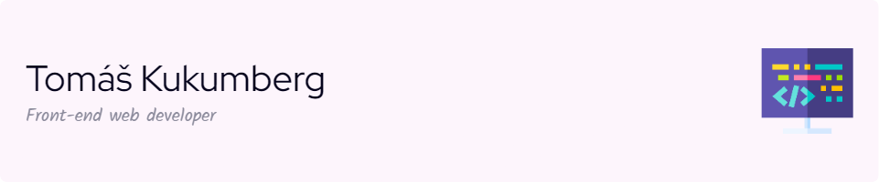

# &gt; Hi there, I'm Tomáš 👋👨‍💻

I'm a software engineer that specializes in front-end. JS frameworks like Vue, Svelte and React are technologies i'm most interested in. 

## 🔧 Favorite technologies

## 💻 Most used languages

